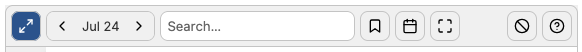

# The Toolbar

Conferia features a toolbar at the top of the schedule that allows you to
control the schedule.

From left to right, these are:

## The View Mode Toggle

This toggle allows you to switch between Conferia's view modes. Conferia can
display either all days at the same time, or just a single day. If the toggle is
highlighted, Conferia uses the compact (that is, single day) mode. In this mode,
use the day selector next to the view mode toggle to view all days. If this
toggle is not active, Conferia shows all days at the same time. In that case,
scroll horizontally to see all days. Depending on the conference, your device,
and whether you are currently at the conference, the initial view mode may
change.

## The Day Selector

This control is only shown when the view mode is set to "compact". Use the
arrow buttons to switch between the conference dates. The middle of this
selector always shows the currently selected day.

## The Search Field

Type into this field to search for events. Note that, if you are in the
compact view mode, this will only search events on the selected day.

## Your Personal Agenda

By default, Conferia will always show all conference events. Activate this
toggle to only show your personal agenda, hiding all events you do not have
placed on your agenda. Note that, like the filter, this setting respects the
view mode and will only show items from your personal agenda that are on the
selected day, if the view mode is set to compact.

## Download events as iCal

This button allows you to export events from the conference into the iCal
format, which is supported by most phones and computers. You can choose whether
you wish to download only your personal agenda items, only the *visible* items,
or all items.

## Fullscreen

This button tells Conferia to use the entire page, which is especially helpful
when the Conferia widget is very small.

## Clear Data

Use this button to clear your user data, including your personal agenda. You
will be asked for confirmation before this happens.

## Help

This button shows a brief on-page help and contains a link to this
documentation.
